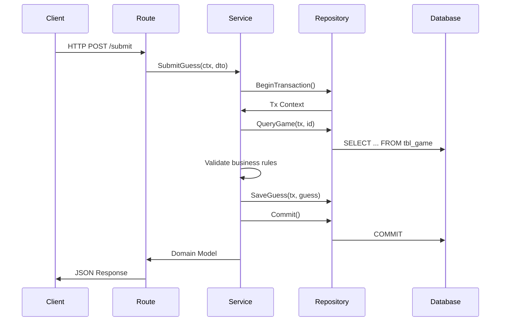
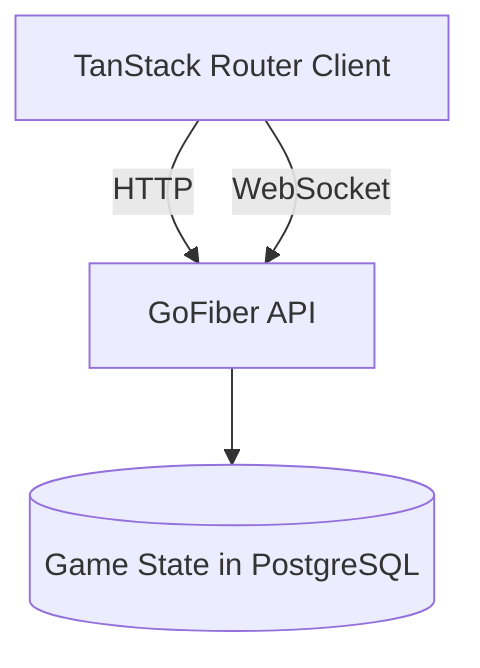

# Wordle - Modern Multiplayer Implementation

[](https://golang.org)
[](https://react.dev)
[](https://www.docker.com)

A full-stack Wordle game with single-player and multi-player modes, featuring real-time gameplay synchronization through pure WebSocket implementation and modern web development practices.

## 🌟 Key Features
- **Dual Game Modes**: Classic singleplayer and real-time multiplayer battles
- **Advanced State Management**: Redux Toolkit with Thunk middleware
- **Optimized Routing**: TanStack Router with code splitting
- **Real-time Communication**: WebSocket-based multiplayer synchronization
- **Accessible UI**: React Aria Components for WCAG compliance
- **Type Safety**: Zod schema validation + [Go validator](https://github.com/go-playground/validator)
- **DevOps Ready**: Complete Docker ecosystem with compose setup

## 🛠 Tech Stack
**Frontend**  
   

**Backend**  
  

**Infra**  
 

## 🚀 Getting Started

### Prerequisites
- Node.js 22.14
- Go 1.24
- Docker
- PostgreSQL 17 (available in [server/docker-compose.yaml](server/docker-compose.yaml)`)
- [Make](https://www.gnu.org/software/make/) (available on most Unix-like systems, installable on Windows)

## 🚀 Running the Project

This project uses `Make` to simplify Docker Compose commands. The general command structure is:

```bash
make [action] [target]
```
Where:
*   `[action]` can be `dev`, `prod`, `stop`, or `down`.
*   `[target]` can be `server`, `client`, or omitted to apply to both.

**Available Commands:**
*   **Run Development Environment:**
	*   Start backend server (dev mode): `make dev server`
	*   Start frontend client (dev mode with HMR): `make dev client`
	*   Start both backend and frontend (dev mode): `make dev`
*   **Run Production Environment:**
	*   Build and start backend server (prod mode): `make prod server`
	*   Build and start frontend client (prod mode): `make prod client`
	*   Build and start both backend and frontend (prod mode): `make prod`
*   **Stop Services:**
	*   Stop backend server containers: `make stop server`
	*   Stop frontend client container: `make stop client`
	*   Stop both containers: `make stop`
*   **Stop and Remove Services:**
	*   Stop and remove backend containers/network: `make down server`
	*   Stop and remove frontend container/network: `make down client`
	*   Stop and remove all containers, networks, and volumes defined in docker-compose: `make down`

**Example:** To start the entire application in development mode:
```bash
make dev
```
This will build the necessary Docker images (if they don't exist) and start the server, client, and PostgreSQL database containers.

## 🚧 Project Structure
The codebase is organized into `client` and `server` directories, promoting a clear separation of concerns.
*   `client`: Contains the React frontend application code.
*   `server`: Contains the GoFiber backend application code.
	*   [`cmd/main.go`](server/cmd/main.go): Entry point for the server application, responsible for setting up dependencies (database, repositories, services) and initializing routes.
	*   `internal`: Houses the core application logic.
		*   `api` or `handler`: Contains the **Route Handlers** (e.g., Fiber handlers). These are responsible for receiving HTTP requests or WebSocket messages, validating input (using [Go validator](https://github.com/go-playground/validator)), calling the appropriate service methods, and formatting the response.
		*   `service`: Contains the **Service Layer**. This layer encapsulates the core business logic of the application (e.g., validating a guess, starting a new game). Services orchestrate calls to one or more repositories and contain logic that doesn't belong directly in the handlers or data access layer.
		*   `repository`: Contains the **Repository Layer**. This layer abstracts the data persistence details. It defines interfaces for data access operations (e.g., `FindGameByID`, `SaveGuess`) and provides implementations (e.g., using GORM and PostgreSQL like in [`server/internal/infrastructure/gorm/repository/game.go`](server/internal/infrastructure/gorm/repository/game.go)). This makes it easier to swap out the database technology if needed.
	*   `pkg`: Contains shared utilities like custom error handling (`errors`).
*   `Dockerfile`: Defines the container image for deployment.
*   `docker-compose.yml`: Defines the multi-container setup (client, server, database).
*   `Makefile`: Provides convenient commands for managing the Docker environment.

This separation ensures that:
1.  Route handlers are lean and focus only on request/response handling.
2.  Business logic is centralized and reusable within the service layer.
3.  Database interactions are isolated within the repository layer, improving testability (services can be tested with mock repositories) and maintainability.



## 🎮 Gameplay
**Single Player**  
Guess the hidden 5-letter word in 6 attempts with color-coded feedback:
- 🟩 Correct letter & position
- 🟨 Correct letter, wrong position
- ⬛ Letter not in word

**Multiplayer Mode**
1. Create a room and share ID
2. Real-time opponent progress tracking to guess the word
3. Synchronized game state via WebSocket
4. Victory/defeat notifications

## 🏗 System Architecture


## 📐 Design Decisions
### 1. State Management Architecture
**Choice**: Redux Toolkit with slice-based organization  
**Rationale**:
- Predictable state container for complex game logic
- Thunk middleware for async game initialization
- Memoized selectors for performant board rendering
- Serializable actions for potential game replay system

### 2. Real-Time Communication
**Choice**: Native WebSocket over Socket.IO  
**Rationale**:
- No protocol overhead for faster message delivery
- Direct control over connection lifecycle
- Go's concurrency model (goroutines) for efficient message broadcasting

### 3. Type Safety Pipeline
**Implementation**: Zod ↔ Go structs with GORM ↔ Database constraints  
**Benefits**:
- Frontend validation with Zod schemas
- GORM model ↔ database schema alignment
- End-to-end type safety from UI to DB

### 4. Routing & Accessibility
**Solution**: TanStack Router + React Aria  
**Advantages**:
- Type-safe route parameters
- Automatic code splitting
- Built-in focus management
- Screen reader support
- Keyboard navigation

### 5. Infrastructure Strategy
**Approach**: Docker Compose with multi-stage builds and `Make` to simplify Docker Compose commands  
**Optimizations**:
- Separate build/runtime containers
- Alpine-based final images
- Shared network for service discovery
- Centralized logging

---

**Crafted with ❤️ by Handy**  
[](https://github.com/handylim/wordle)